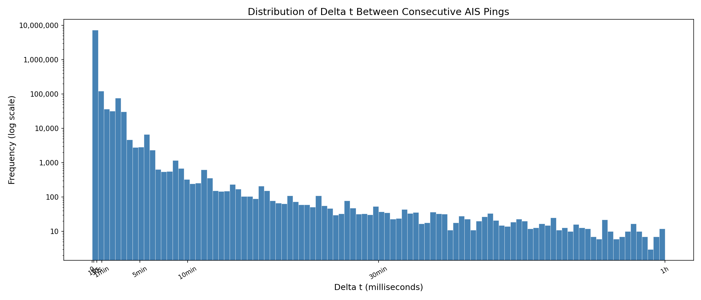

<!-- vim: set ft=markdown fenc=utf-8 tw=88 nu ai si et ts=2 sw=2: -->

# Assignment 3: Scalable Maritime AIS Noise Filtering and Temporal Analysis with MongoDB Sharding

**Course:** Big Data Analysis (10 ECTS), VU MIF, Spring 2026

**Study program:** MSc Data Science

**Team:** [Gedas Beržinskas](https://github.com/Berzinskass), [Jonas
Adomaitis](https://github.com/JonasIBM), [Tomas
Giedraitis](https://github.com/00riddle00)

## Table of Contents:

<!--toc:start-->
- [Assignment 3: Scalable Maritime AIS Noise Filtering and Temporal Analysis with MongoDB Sharding](#assignment-3-scalable-maritime-ais-noise-filtering-and-temporal-analysis-with-mongodb-sharding)
  - [Table of Contents:](#table-of-contents)
  - [📌 Pinned: Demo: MongoDB Instance Failure and Recovery (Task 5)](#📌-pinned-demo-mongodb-instance-failure-and-recovery-task-5)
- [Part I – Assignment Specification](#part-i-assignment-specification)
  - [Objective](#objective)
  - [Dataset](#dataset)
  - [Instructions](#instructions)
    - [Task 1: Create a NoSQL Database Cluster](#task-1-create-a-nosql-database-cluster)
    - [Task 2: Data Insertion in Parallel](#task-2-data-insertion-in-parallel)
    - [Task 3: Data Noise Filtering in Parallel](#task-3-data-noise-filtering-in-parallel)
    - [Task 4: Calculation of `delta t` and Histogram Generation](#task-4-calculation-of-delta-t-and-histogram-generation)
    - [Task 5: Presentation of the Solution](#task-5-presentation-of-the-solution)
    - [Submission Guidelines](#submission-guidelines)
    - [Note](#note)
  - [Additional – Dataset Schema](#additional-dataset-schema)
- [Part II – Our Implementation](#part-ii-our-implementation)
  - [Development](#development)
  - [Running](#running)
  - [System Specifications](#system-specifications)
  - [Cluster Architecture](#cluster-architecture)
  - [Results](#results)
    - [Task 2 – Parallel Insertion](#task-2-parallel-insertion)
    - [Task 3 – Parallel Noise Filtering](#task-3-parallel-noise-filtering)
    - [Task 4 – Delta t Analysis](#task-4-delta-t-analysis)
    - [Task 5 – Failure and Recovery Demo](#task-5-failure-and-recovery-demo)
<!--toc:end-->

## 📌 Pinned: Demo: MongoDB Instance Failure and Recovery (Task 5)

https://github.com/user-attachments/assets/9f798a51-4c97-40fd-979b-1c393a59bb1c

# Part I – Assignment Specification

## Objective

The objective of this assignment is to filter out noise from a given dataset using NoSQL
databases and perform data analysis. The dataset contains vessel information, and your
task is to apply various filters to eliminate noise and calculate the time difference
between data points for each vessel.

## Dataset

Link:
[http://aisdata.ais.dk/aisdk-2026-04-18.zip](http://aisdata.ais.dk/aisdk-2026-04-18.zip)

If browser does not permit to open this HTTP link, you will need to use `wget` or `curl`
to download the dataset. But at first try not clicking on the link, but copying it and
pasting in the browser address bar, that could work.

---

## Instructions

### Task 1: Create a NoSQL Database Cluster

- Set up a cluster of NoSQL databases either on your personal machine or on MIF
  virtual machines.
- Configure the cluster and ensure its proper functioning. This can be either a
  replication setup or a sharding setup (*sharding* will be graded higher).
- `Docker Compose` is recommended, but not mandatory.

### Task 2: Data Insertion in Parallel

- Implement a program to read data from a `CSV` file.
- Use separate instances of the `MongoClient` for each parallel thread or task.
- Please insert into the database an amount of data sufficient for your PC or
  virtual machine memory.

### Task 3: Data Noise Filtering in Parallel

- Implement a parallel data noise filtering process that operates on the
  inserted data.
- Identify and filter out noise based on specific criteria, including vessels
  with fewer than `100` data points and missing or invalid fields (e.g.,
  `Navigational status`, `MMSI`, `Latitude`, `Longitude`, `ROT`, `SOG`, `COG`,
  `Heading`).
- Store the filtered data in a separate `collection` within the NoSQL
  databases.
- Consider creating appropriate indexes for efficient filtering.

### Task 4: Calculation of `delta t` and Histogram Generation

- Calculate the time difference (`delta t`) in milliseconds between two
  subsequent data points for each filtered vessel.
- Generate a histogram based on the calculated `delta t` values.
- Analyze the histogram to gain insights into vessel behavior.

### Task 5: Presentation of the Solution

- Record a short video where you showcase one of the MongoDB database instance
  failures and how the system continues to operate.

### Submission Guidelines

- Upload the code and solution to the *Big data analysis* system.
- Late submissions will be penalized by deducting `0.5` points from the total
  score per hour.

### Note

All groups have the same assignment version, and collaboration within the group is
encouraged. Good luck with the assignment!

---

## Additional – Dataset Schema

The AIS CSV files contain 26 columns:

| #  | Columns in `*.csv` file        | Format                                                                                                       |
| -- | ------------------------------ | ------------------------------------------------------------------------------------------------------------ |
| 1  | Timestamp                      | Timestamp from the AIS basestation, format: `31/12/2026 23:59:59`                                            |
| 2  | Type of mobile                 | Describes what type of target this message is received from (class A AIS Vessel, Class B AIS vessel, etc)    |
| 3  | MMSI                           | MMSI number of vessel                                                                                        |
| 4  | Latitude                       | Latitude of message report (e.g. `57,8794`)                                                                  |
| 5  | Longitude                      | Longitude of message report (e.g. `17,9125`)                                                                 |
| 6  | Navigational status            | Navigational status from AIS message if available, e.g.: `Engaged in fishing`, `Under way using engine`, mv. |
| 7  | ROT                            | Rot of turn from AIS message if available                                                                    |
| 8  | SOG                            | Speed over ground from AIS message if available                                                              |
| 9  | COG                            | Course over ground from AIS message if available                                                             |
| 10 | Heading                        | Heading from AIS message if available                                                                        |
| 11 | IMO                            | IMO number of the vessel                                                                                     |
| 12 | Callsign                       | Callsign of the vessel                                                                                       |
| 13 | Name                           | Name of the vessel                                                                                           |
| 14 | Ship type                      | Describes the AIS ship type of this vessel                                                                   |
| 15 | Cargo type                     | Type of cargo from the AIS message                                                                           |
| 16 | Width                          | Width of the vessel                                                                                          |
| 17 | Length                         | Length of the vessel                                                                                         |
| 18 | Type of position fixing device | Type of positional fixing device from the AIS message                                                        |
| 19 | Draught                        | Draught field from AIS message                                                                               |
| 20 | Destination                    | Destination from AIS message                                                                                 |
| 21 | ETA                            | Estimated Time of Arrival, if available                                                                      |
| 22 | Data source type               | Data source type, e.g. AIS                                                                                   |
| 23 | Size A                         | Length from GPS to the bow                                                                                   |
| 24 | Size B                         | Length from GPS to the stern                                                                                 |
| 25 | Size C                         | Length from GPS to starboard side                                                                            |
| 26 | Size D                         | Length from GPS to port side                                                                                 |

---

# Part II – Our Implementation

## Development

Prerequisites:

- Docker + Docker Compose
- [uv](https://docs.astral.sh/uv/) for Python dependency management

Install dependencies:

```bash
uv sync
```

Lint and auto-fix:

```bash
uv run ruff check --fix .
```

Sort and format imports:

```bash
uv run ruff check --select I --fix .
```

Format code:

```bash
uv run ruff format .
```

Apply Black string processing normalization:

```bash
uv run black .
```

or using full flags:

```bash
uv run black --line-length=88 --preview --enable-unstable-feature=string_processing .
```

## Running

**1. Start the cluster:**

```bash
docker compose up -d
```

**2. Initialize replica sets and sharding (run once):**

```bash
docker exec -it configsvr1 mongosh --eval "$(cat scripts/init_configsvr.js)"
docker exec -it shard1 mongosh --eval "$(cat scripts/init_shard1.js)"
docker exec -it shard2 mongosh --eval "$(cat scripts/init_shard2.js)"
docker exec -it mongos mongosh --eval "$(cat scripts/init_mongos.js)"
```

**3. Place the dataset:**

Download `aisdk-2026-04-18.csv` from the dataset link and place it in `data_arch/`.

**4. Run the pipeline:**

```bash
# Task 2: Insert data
docker exec -it worker uv run --project / python insert.py

# Task 3: Filter noise
docker exec -it worker uv run --project / python filter.py

# Task 4: Calculate delta t and generate histogram
docker exec -it worker uv run --project / python analyze.py
```

Results are written to `outputs/`.

## Makefile Targets

| Target           | Description                                               |
| ---------------- | --------------------------------------------------------- |
| `make help`      | Show all available targets                                |
| `make all`       | Run full pipeline: up + init + insert + filter + analyze  |
| `make deps`      | Install Python dependencies via uv (incremental)          |
| `make data`      | Show instructions for downloading the AIS dataset         |
| `make lint`      | Lint and format Python code (ruff + black)                |
| `make up`        | Start the MongoDB sharded cluster                         |
| `make down`      | Stop the MongoDB sharded cluster                          |
| `make init`      | Initialize replica sets and enable sharding               |
| `make insert`    | Run parallel CSV insertion (Task 2)                       |
| `make filter`    | Run parallel noise filtering (Task 3)                     |
| `make analyze`   | Run delta t calculation and histogram generation (Task 4) |
| `make test`      | Run unit tests                                            |
| `make clean`     | Remove generated output files                             |
| `make clean-env` | Remove Python virtual environment                         |
| `make distclean` | clean + clean-env + down + remove Docker volumes          |

## System Specifications

**Hardware:**

| Component | Specification                                                |
| --------- | ------------------------------------------------------------ |
| Model     | Lenovo IdeaCentre Gaming 5 14ACN6 (AMD)                      |
| CPU       | AMD Ryzen 7 5700G, 8 Cores/16 Threads, 3.8 GHz (max 4.6 GHz) |
| RAM       | 32 GB DDR4 3200 MHz (dual-channel)                           |
| Storage   | Samsung PM981a 1 TB NVMe SSD (PCIe 3.0 x4)                   |
| GPU       | NVIDIA GeForce RTX 3060 12 GB                                |

**Software:**

| Component | Version                              |
| --------- | ------------------------------------ |
| OS        | Arch Linux                           |
| Kernel    | 7.0.5 (Arch Linux)                   |
| Docker    | 29.4.3                               |
| Python    | 3.13.11 (inside worker container)    |
| MongoDB   | 7.0.32 (inside containers)           |

## Cluster Architecture

The MongoDB sharded cluster consists of 7 Docker containers:

- **3× Config servers** (`configsvr1`, `configsvr2`, `configsvr3`) – form a replica set
  (`configrs`) that stores cluster metadata and shard topology.
- **2× Shards** (`shard1`, `shard2`) – each a single-node replica set, storing the
  actual AIS data.
- **1× mongos router** – the entry point for all client connections; routes queries to
  the correct shard based on the shard key.
- **1× Python worker** – runs insertion, filtering, and analysis scripts.

The `vessels_raw` collection is sharded by **hashed MMSI**, resulting in near-perfect
data distribution:

| Shard     | Documents  | Share  |
| --------- | ---------- | ------ |
| shard1rs  | 10,244,176 | 49.37% |
| shard2rs  | 10,503,170 | 50.62% |

Sharding was chosen over replication as it provides horizontal scalability and is graded
higher per the assignment specification.

> **Note on single-node shards:** Each shard uses a single-node replica set for
> simplicity. In a production setup with multiple nodes per shard, reads could continue
> from secondary nodes during a primary failure. In our setup, a shard going down causes
> queries to that shard to fail until it recovers.

## Results

### Task 2 – Parallel Insertion

| Metric             | Value           |
| ------------------ | --------------- |
| Documents inserted | 20,747,346      |
| Workers            | 8               |
| Chunk size         | 50,000 rows     |
| Time elapsed       | 226.8s          |
| Throughput         | 91,466 docs/sec |

8 workers was chosen as a reasonable default for IO-bound insertion. Unlike CPU-bound
workloads (e.g. Assignment 1's parallel anomaly detection, where 15 workers achieved
8.39× speedup), insertion throughput is limited by MongoDB write latency rather than CPU
cores. Further benchmarking with varying worker counts would be a natural extension.

### Task 3 – Parallel Noise Filtering

Filtering criteria applied in order:
1. Discard records with missing or invalid required fields
2. Discard vessels with fewer than 100 valid data points

| Metric           | Value      |
| ---------------- | ---------- |
| Input vessels    | 5,118      |
| Vessels kept     | 1,834      |
| Records kept     | 13,957,451 |
| Time elapsed     | 111.8s     |

MMSIs are split across workers by index rather than by record count, which results in
uneven load distribution (e.g. Worker 5 kept 406 vessels vs Worker 0 kept 198). This
does not affect correctness – all vessels are processed – but a record-count-aware split
would improve load balance.

### Task 4 – Delta t Analysis

| Metric        | Value                       |
| ------------- | --------------------------- |
| Total delta t | 7,552,958                   |
| Min delta t   | 1,000 ms (1 second)         |
| Max delta t   | 74,985,000 ms (~20.8 hours) |
| Mean delta t  | 17,046 ms (~17 seconds)     |

The histogram shows a clear exponential decay pattern – the vast majority of consecutive
pings occur within 1-2 minutes, consistent with normal Class A AIS reporting intervals
(2-10 seconds when underway). The long tail extending to ~20 hours represents vessels at
anchor or with intermittent signal. A log scale on the Y axis is used to keep the tail
visible alongside the dominant short-interval spike.



### Task 5 – Failure and Recovery Demo

The demo video shows shard2 being stopped, the resulting error when querying the
cluster, followed by shard2 being restarted and full data accessibility being restored.

> **Note:** During the filtering stage (Task 3), shard2 also crashed spontaneously due
> to memory pressure from heavy parallel load – a real-world failure event, not a
> scripted one. The system recovered automatically upon restart with all data intact and
> the 50/50 shard distribution preserved.

YouTube:
[https://www.youtube.com/watch?v=vY6sZFBE_JU](https://www.youtube.com/watch?v=vY6sZFBE_JU)

Video file:
[outputs/demo_mongodb_instance_failure_recovery.mp4](outputs/demo_mongodb_instance_failure_recovery.mp4)

